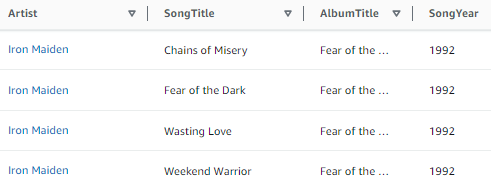
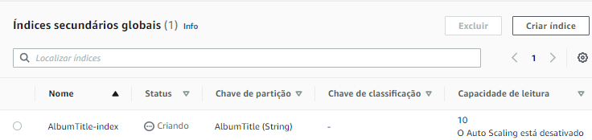

# 8 Projeto do Bootcamp

## Bootcamp Data Science Unimed-BH/DIO

### Marcelo Lopes Valerio                         e-mail: mar.valerio@hotmail.com.br

### Neste projeto, fomos iniciados na utilização do banco de dados NoSQL da AWS, DynamoDB, um banco de dados gerenciado pela mesma, o qual, por meio de queries é possível realizar consultas, e, devido à sua dinâmica de indices, suas consultas são bem semelhantes à de um banco de dados relacional, como será exemplificado abaixo.

## Utilizando o AWS CLI para criar e consultar a tabela

### O primeiro passo é instalar o AWS CLI, para interagir com o sistema por meio de linhas de comando. Para isso, faça o download na própria AWS, e depois abra um terminal, e digite os comando abaixo:
```
aws
aws config
```
### O primeiro comando ira apenas testar se a instalação foi realmente sucedida, já o segundo, irá exigir que você entre com um usuário do AWS IAM, o qual sugiro que crie um novo, e conceda as politicas de permissões relacioandas ao DynamoDB, de acordo com o que deseja que seja permitido (todas permissões, read only, etc). Em seguida, crie a tabela Music;
```
aws dynamodb create-table \
    --table-name Music \
    --attribute-definitions \
        AttributeName=Artist,AttributeType=S \
        AttributeName=SongTitle,AttributeType=S \
    --key-schema \
        AttributeName=Artist,KeyType=HASH \
        AttributeName=SongTitle,KeyType=RANGE \
    --provisioned-throughput \
        ReadCapacityUnits=10,WriteCapacityUnits=5
```
### Essa tabela conta com os seguintes campos: 

<div align="center">
    
</div>

### Apenas com essa configuração inicial, podemos executar a seguinte query, para inserir itens:
```
aws dynamodb batch-write-item \
    --request-items file://batchmusic.json
```
### Esse comando irá ler o arquivo json na pasta src, chamado itemmusic.json, e fazer a requisição para o servidor da aws, certifique-se de que o comando seja dado neste diretório. A seguir, ao executar o comando abaixo, realizará uma query para consultar todas as músicas registradas com o artista:
```
aws dynamodb query \
    --table-name Music \
    --key-condition-expression "Artist = :artist" \
    --expression-attribute-values  '{":artist":{"S":"Red Hot Chili Peppers"}}'
```
### E também pela música do artista;
```
aws dynamodb query \
    --table-name Music \
    --key-condition-expression "Artist = :artist and SongTitle = :title" \
    --expression-attribute-values '{":artist":{"S":"Red Hot Chili Peppers"},":title":{"S":"Give It Away"}}'
```
### A seguir, criaremos um novo indice global secundario, para que seja possível realizar queries de consulta com base neste item. Abaixo, isso será feito para o nome do album.
```
aws dynamodb update-table \
    --table-name Music \
    --attribute-definitions AttributeName=AlbumTitle,AttributeType=S \
    --global-secondary-index-updates \
        "[{\"Create\":{\"IndexName\": \"AlbumTitle-index\",\"KeySchema\":[{\"AttributeName\":\"AlbumTitle\",\"KeyType\":\"HASH\"}], \
        \"ProvisionedThroughput\": {\"ReadCapacityUnits\": 10, \"WriteCapacityUnits\": 5      },\"Projection\":{\"ProjectionType\":\"ALL\"}}}]"
```
### Essa ação demorará alguns segundos, é possível consultar o seu status na aba de indices. Enquanto um indice estiver sendo criado, um outro não poderá ser, é necessário esperar que o primeiro seja concluido.

<div align="center">
    
</div>

### Serão criados mais alguns indices secundarios, pelos comandos abaixo.
```
aws dynamodb update-table \
    --table-name Music \
    --attribute-definitions\
        AttributeName=Artist,AttributeType=S \
        AttributeName=AlbumTitle,AttributeType=S \
    --global-secondary-index-updates \
        "[{\"Create\":{\"IndexName\": \"ArtistAlbumTitle-index\",\"KeySchema\":[{\"AttributeName\":\"Artist\",\"KeyType\":\"HASH\"}, {\"AttributeName\":\"AlbumTitle\",\"KeyType\":\"RANGE\"}], \
        \"ProvisionedThroughput\": {\"ReadCapacityUnits\": 10, \"WriteCapacityUnits\": 5      },\"Projection\":{\"ProjectionType\":\"ALL\"}}}]"
```
### O comando acima criará um indice para realizar queries com base no nome do artista e no título do álbum simultaneamente, e o abaixo, baseado no título da música e no ano.
```
aws dynamodb update-table \
    --table-name Music \
    --attribute-definitions\
        AttributeName=SongTitle,AttributeType=S \
        AttributeName=SongYear,AttributeType=S \
    --global-secondary-index-updates \
        "[{\"Create\":{\"IndexName\": \"SongTitleYear-index\",\"KeySchema\":[{\"AttributeName\":\"SongTitle\",\"KeyType\":\"HASH\"}, {\"AttributeName\":\"SongYear\",\"KeyType\":\"RANGE\"}], \
        \"ProvisionedThroughput\": {\"ReadCapacityUnits\": 10, \"WriteCapacityUnits\": 5      },\"Projection\":{\"ProjectionType\":\"ALL\"}}}]"
```
### Com os indices criados, agora é possível realizar queries mais complexas, como:

### Pelo título do album;
```
aws dynamodb query \
    --table-name Music \
    --index-name AlbumTitle-index \
    --key-condition-expression "AlbumTitle = :name" \
    --expression-attribute-values  '{":name":{"S":"Californication"}}'
```
### Nome do artista e titulo do album;
```
aws dynamodb query \
    --table-name Music \
    --index-name ArtistAlbumTitle-index \
    --key-condition-expression "Artist = :v_artist and AlbumTitle = :v_title" \
    --expression-attribute-values  '{":v_artist":{"S":"Pink Floyd"},":v_title":{"S":"Wish You Were Here"} }'
```
### Pelo nome da música e ano;
```
aws dynamodb query \
    --table-name Music \
    --index-name SongTitleYear-index \
    --key-condition-expression "SongTitle = :v_song and SongYear = :v_year" \
    --expression-attribute-values  '{":v_song":{"S":"Have a Cigar"},":v_year":{"S":"1975"} }'
```