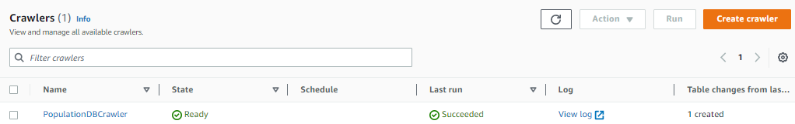

# 9 Projeto do Bootcamp

## Bootcamp Data Science Unimed-BH/DIO

### Marcelo Lopes Valerio                         e-mail: mar.valerio@hotmail.com.br

### Neste projeto, utilizamos serviços da AWS para realizar um projeto onde o destaque foi a utilização de Big Data. A partir de um arquivo csv, disponibilizado nesse projeto, o primeiro passo foi criar um bucket no Amazon S3, que é basicamente o lugar onde serão salvos a entrada (o csv), e a saída (queries salvas na Athena, abordados posteriormente).
### No arquivo brazil_population_2019.csv, há uma tabela gigantesca, com dados como cidade, população e estado pertencente.

<div align="center">
    
</div>

### Após isso, é criado um crawler no AWS Glue, que é responsável por ler o csv fornecido no S3, e convertêlo em uma tabela num banco de dados. Para isso, basta selecionar a pasta no S3 onde o arquivo está disponibilizado como data source do crawler, e executá-lo, com isso, a tabela já será criada.

<div align="center">
    
</div>
<div align="center">
    
</div>

### O passo a seguir é utilizar o AWS Athena para executar queries SQL sobre a tabela criada. Alguns exemplos são mostrados abaixo. É possível ainda salvar essas queries dentro do S3.

```
-- Soma da população do Brasil
select
	sum(population)
from "population"."population";

-- População agrupada por cidade
select city, population
from "population"."population";

-- As 10 cidades mais populosas
select * from "population"."population"
order by population
limit 10;

-- População por região, ordenada pela população
select region,
	sum(population)
from "population"."population"
group by region
order by sum(population);
```

### Após efetuar as queries, foi utilizado o AWS Quicksight para gerar um dashboard com dados julgados úteis que puderam ser extraídos da tabela, como população total, população por estado/região e cidades por região.

<div align="center">
    
</div>

### Recomendo analizar o dashboard pelo pdf, pois infelizmente a fonte é reduzida ao exportar o mesmo, e fica ilegível.